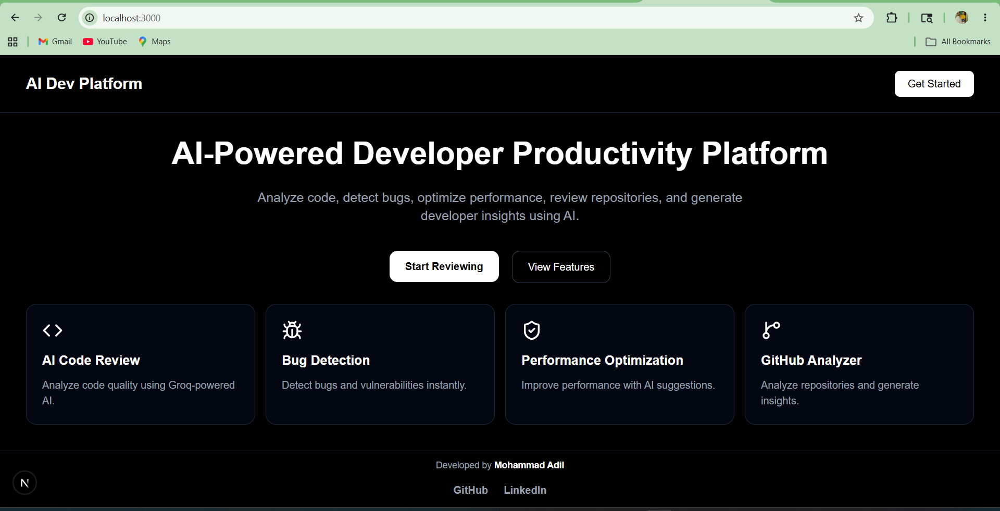
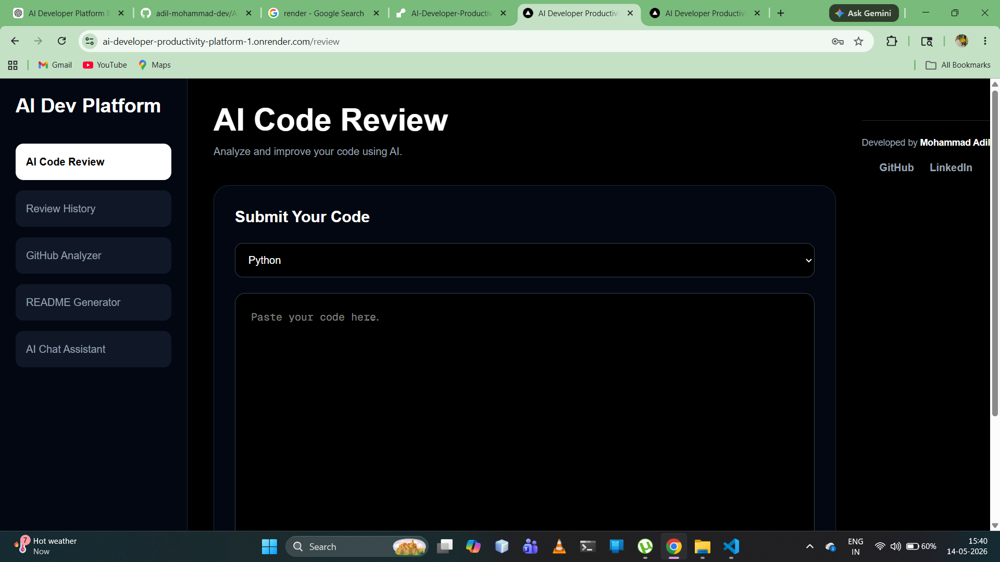
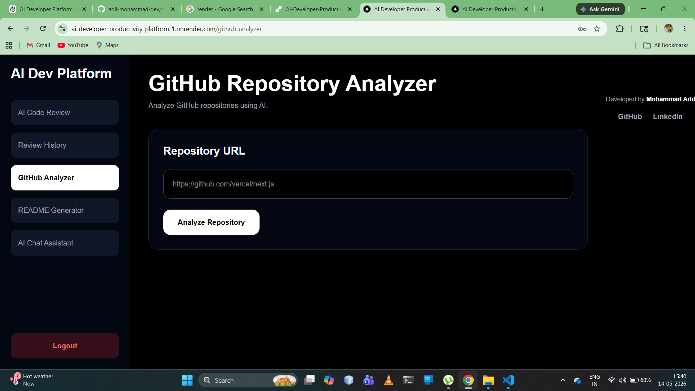
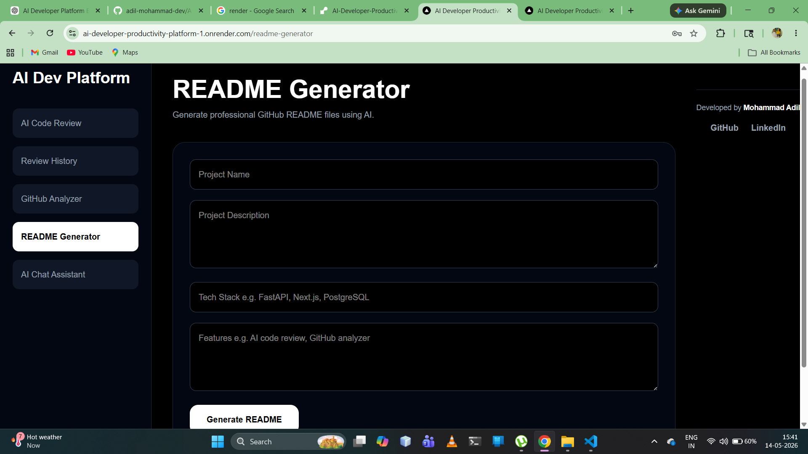
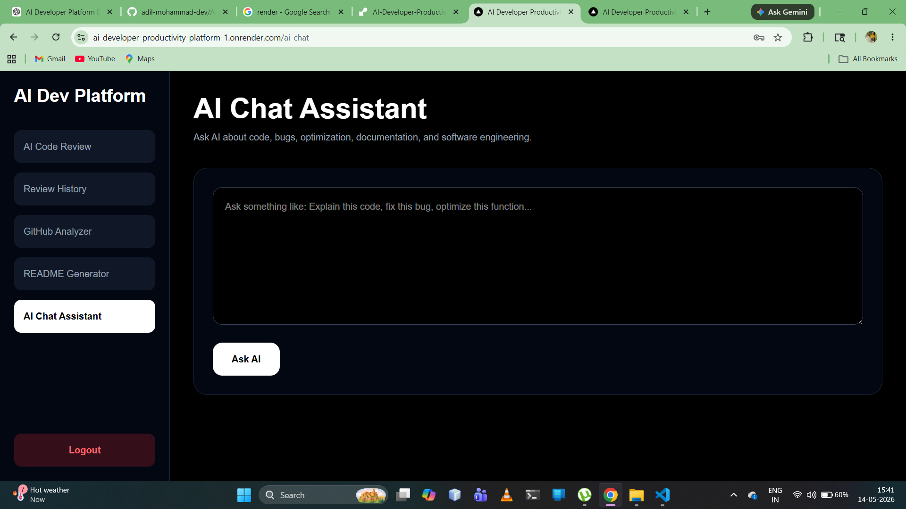
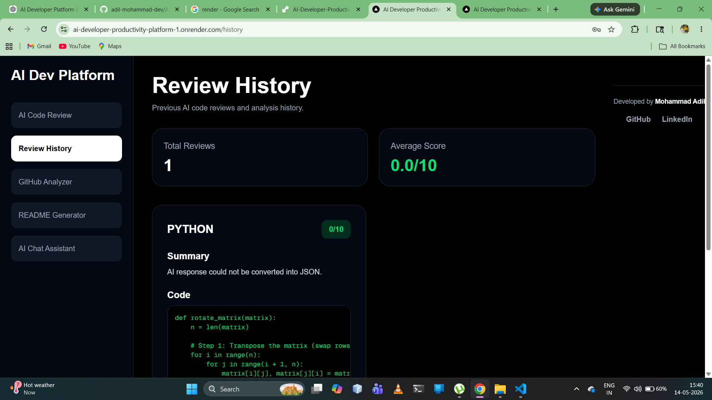

# AI Developer Productivity Platform

An all-in-one AI-powered developer productivity platform designed to help developers review code, analyze repositories, generate professional README files, and interact with an AI coding assistant in real time.

Built using modern full-stack technologies with Groq LLM integration, secure authentication, cloud deployment, and responsive SaaS-style UI.

---

## 🚀 Live Demo

### Frontend  
https://ai-developer-productivity-platform-1.onrender.com

### GitHub Repository  
https://github.com/adil-mohammad-dev/AI-Developer-Productivity-Platform

---

# ✨ Features

## 🤖 AI Code Review
- Analyze code quality using Groq LLM
- Detect bugs and security issues
- Performance optimization suggestions
- Best practice recommendations
- Improved code generation
- Copy optimized code instantly

---

## 📊 Review History Dashboard
- Track previous AI code reviews
- Analytics cards
- Average review score calculation
- Responsive dashboard UI

---

## 🔍 GitHub Repository Analyzer
- Analyze GitHub repositories using AI
- Detect tech stack automatically
- Identify strengths and weaknesses
- Scalability analysis
- Improvement recommendations

---

## 📝 AI README Generator
- Generate professional README.md files
- Auto-create:
  - installation steps
  - tech stack
  - folder structure
  - API sections
  - future improvements
- Copy README
- Download README.md instantly

---

## 💬 AI Chat Assistant
- Ask programming questions in real time
- Debug code
- Explain algorithms
- Optimize functions
- Get software engineering guidance

---

## 🔐 Authentication System
- User registration
- Secure login system
- Protected routes
- JWT token authentication

---

# 🖥️ Screenshots

## 🏠 Home Page



---

## 🤖 AI Code Review



---

## 🔍 GitHub Analyzer



---

## 📝 README Generator



---

## 💬 AI Chat Assistant



---

## 📊 Review History Dashboard



---

# 🛠️ Tech Stack

## Frontend
- Next.js 16
- React
- Tailwind CSS
- React Hot Toast

## Backend
- FastAPI
- Python
- Groq API
- JWT Authentication

## Database
- PostgreSQL

## Deployment
- Render
- GitHub

---

# 📂 Project Structure

```bash
AI-Developer-Productivity-Platform
│
├── backend
│   ├── app
│   ├── routes
│   ├── services
│   └── models
│
├── frontend
│   ├── src
│   ├── app
│   ├── components
│   └── pages
│
├── screenshots
│
└── README.md
```

---

# ⚙️ Installation

## Clone Repository

```bash
git clone https://github.com/adil-mohammad-dev/AI-Developer-Productivity-Platform.git
```

---

## Frontend Setup

```bash
cd frontend
npm install
npm run dev
```

---

## Backend Setup

```bash
cd backend
pip install -r requirements.txt
uvicorn app.main:app --reload
```

---

# 🔑 Environment Variables

## Backend `.env`

```env
GROQ_API_KEY=your_groq_api_key
DATABASE_URL=your_postgresql_database_url
SECRET_KEY=your_secret_key
```

---

# 📈 Future Improvements

- AI-powered code auto-fixing
- Real-time collaborative reviews
- GitHub OAuth login
- AI pull request analysis
- Docker deployment
- CI/CD pipeline integration
- Multi-language code execution

---

# 📱 Responsive Design

Fully responsive across:
- Desktop
- Tablet
- Mobile devices

---

# 👨‍💻 Author

## Mohammad Adil

- GitHub:  
https://github.com/adil-mohammad-dev

- LinkedIn:  
https://www.linkedin.com/in/mohammad-adil-dev/

---

# ⭐ Support

If you found this project useful, consider giving it a star on GitHub ⭐